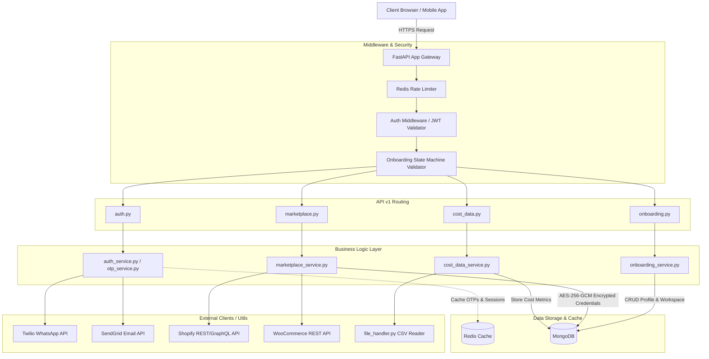

# **Realify AI Onboarding & Marketplace Intelligence Backend**

[](https://fastapi.tiangolo.com/)
[](https://www.mongodb.com/)
[](https://redis.io/)
[](https://www.python.org/)

A secure, highly scalable, and modular asynchronous backend for the **Realify AI Marketplace Intelligence Platform**. The system provides a passwordless/OTP-centric user onboarding pipeline, multi-tenant workspace isolation, secure marketplace credential storage, Shopify/WooCommerce store integrations, and merchant cost data ingestion.

---

## 🏗️ **System Architecture**

The backend strictly follows a decoupled, service-oriented architecture within a modular monolith. Business logic in the service layer is entirely separated from API routing and database operations.



---

## 📂 **Project Directory Structure**

The repository is structured logically to separate concerns into specific modules:

```text
├── app/
│   ├── api/
│   │   └── v1/
│   │       ├── routes/
│   │       │   ├── auth.py           # OTP requests, validation, and tokens
│   │       │   ├── cost_data.py      # Upload and ingest merchant cost data
│   │       │   ├── marketplace.py    # Shopify OAuth handshake & WooCommerce config
│   │       │   └── onboarding.py     # Profile generation & workspace creation
│   │       └── __init__.py
│   ├── config/
│   │   ├── config.py                 # Pydantic BaseSettings environment validation
│   │   └── database.py               # Async MongoDB client setup (Motor) & Redis connection
│   ├── core/
│   │   └── security.py               # JWT encoding/decoding & AES-256-GCM encryption utilities
│   ├── middleware/
│   │   └── auth_middleware.py        # Authentication & onboarding state gating dependencies
│   ├── models/
│   │   ├── onboarding.py             # Pydantic/Motor schemas for workspaces and integration state
│   │   └── user.py                   # User document models & onboarding state enumeration
│   ├── schemas/
│   │   ├── auth.py                   # Input/output schemas for authentication payloads
│   │   └── onboarding.py             # Validation schemas for profile, workspaces, & integration
│   ├── services/
│   │   ├── auth_service.py           # Authentication session handling
│   │   ├── cost_data_service.py      # Standardizes cost metrics & QuickBooks syncing
│   │   ├── email_service.py          # SendGrid integration wrapper
│   │   ├── marketplace_service.py    # OAuth handling & store validation logic
│   │   ├── onboarding_service.py     # Step-by-step onboarding pipeline execution
│   │   ├── otp_service.py            # OTP generation, caching, and matching
│   │   └── whatsapp_service.py       # Twilio integration wrapper
│   ├── utils/
│   │   ├── file_handler.py           # Secure file handler & CSV parser
│   │   └── validators.py             # Generic formatting & domain validators
│   └── main.py                       # Application entry point, middleware register & startup events
├── tests/
│   ├── conftest.py                   # Pytest async fixtures, mock databases, and environment configuration
│   ├── test_auth.py                  # Authentication endpoints test suite
│   ├── test_cost_data.py             # Cost data CSV ingestion test suite
│   ├── test_marketplace.py           # Shopify OAuth & WooCommerce endpoint test suite
│   └── test_onboarding.py            # Onboarding state machine test suite
├── .env.example                      # Reference template for required environment configurations
├── .gitignore                        # Standard Python gitignore filters
└── requirements.txt                  # Python dependency list
```

---

## ⚡ **Onboarding State Machine**

Access to endpoints is guarded dynamically using `auth_middleware.py` which evaluates the user's current `onboarding_state`.

```text
  [ AWAITING_PROFILE ] ────► Captures first_name and last_name
           │
           ▼
 [ AWAITING_WORKSPACE ] ──► Registers tenant/company metadata
           │
           ▼
[ AWAITING_INTEGRATION ] ─► Initiates Shopify OAuth or WooCommerce connection
           │
           ▼
       [ ACTIVE ] ────────► Access granted to core dashboard metrics & cost ingestion
```

---

## 🚀 **Getting Started & Local Setup Guide**

Follow these steps to configure your environment, launch external services, and run the backend locally.

### 📋 **Prerequisites**
Before setting up the project, make sure you have the following installed on your machine:
*   **Python 3.10+**: Confirm your version by running `python --version` or `python3 --version`.
*   **Docker Desktop / Docker Engine**: Needed to run the Redis server container.
*   **MongoDB**: An active MongoDB server (can be a local instance or a free cloud-hosted MongoDB Atlas cluster).

---

### 🐳 **1. Run Redis Dependency via Docker Compose**
Redis is utilized for session management, dynamic rate limiting, and OTP caching. The codebase relies on a running Redis instance. A persistent, containerized Redis image has been preconfigured using `docker-compose.yml`.

To launch Redis in daemon mode:
```bash
docker compose up -d
```

#### **Useful Container Commands:**
*   **Check Container Status**: Verify that the container is active and listening on port `6379`:
    ```bash
    docker ps --filter name=realify_redis
    ```
*   **Check Logs**: Inspect the Redis container output:
    ```bash
    docker logs realify_redis
    ```
*   **Stop Container**: Shutdown the Redis database container when finished:
    ```bash
    docker compose down
    ```

> [!NOTE]
> **Persistent Memory**: The `docker-compose.yml` mounts a Docker volume (`redis_data`) mapped to `/data` in the container. This ensures your keys, OTP states, and active rate limits persist even if the container is restarted.

---

### ⚙️ **2. Configure Environment Variables (`.env`)**

The application requires specific configuration keys to launch. Copy the example environment template to create your localized configurations:

```bash
cp .env.example .env
```

Open your newly created `.env` file and configure the settings according to the details below:

| Section | Environment Variable | Default / Example Value | Description |
| :--- | :--- | :--- | :--- |
| **API** | `PROJECT_NAME` | `"Realify AI Onboarding Backend"` | The name shown in interactive OpenAPI documents. |
| | `DEBUG` | `true` | Enables/disables auto-reload, verbose error tracing, and raw console logging mocks. |
| | `HOST` & `PORT` | `127.0.0.1` / `8000` | Host interface address and port the server binds to. |
| **MongoDB** | `MONGODB_URI` | `mongodb://localhost:27017` | Standard database connection string. Can point to a cloud MongoDB Atlas URI. |
| | `DATABASE_NAME` | `realify_onboarding` | MongoDB Database collection namespace. |
| **Redis** | `REDIS_HOST` & `REDIS_PORT` | `127.0.0.1` / `6379` | Hostname/port matching the running Docker Compose Redis container. |
| | `REDIS_PASSWORD` | `""` | Optional connection password if configured. Defaults to empty. |
| | `REDIS_DB` | `0` | Redis database slot. |
| **Security** | `JWT_SECRET` | *(See Generation Command)* | Signature key used to encrypt JWT access and refresh session tokens. |
| | `JWT_ALGORITHM` | `HS256` | Algorithmic hashing method for JWT payloads. |
| | `ACCESS_TOKEN_EXPIRE_MINUTES`| `30` | Expiration time frame for basic API requests. |
| | `REFRESH_TOKEN_EXPIRE_DAYS` | `7` | Secure refresh token duration. |
| | `ENCRYPTION_KEY` | *(See Generation Command)* | URL-safe base64 32-byte key used for AES-256-GCM encryption of store tokens. |
| **Third-Party** | `SENDGRID_API_KEY` | `SG.placeholder` | SendGrid integration token. Mock mode activates if left as placeholder. |
| | `SENDGRID_FROM_EMAIL` | `noreply@realify.ai` | Verified email sender in SendGrid. |
| | `TWILIO_ACCOUNT_SID` | `ACplaceholder` | Twilio account identifier. |
| | `TWILIO_AUTH_TOKEN` | `placeholder` | Twilio authorization token. |
| | `TWILIO_WHATSAPP_FROM` | `whatsapp:+14155238886` | Twilio virtual sandbox sender phone number. |
| **E-Commerce** | `SHOPIFY_CLIENT_ID` | `placeholder` | Shopify developer client ID credentials. |
| | `SHOPIFY_CLIENT_SECRET` | `placeholder` | Shopify developer client secret credentials. |
| | `SHOPIFY_REDIRECT_URI` | `http://localhost:8000/v1/marketplace/shopify/callback` | Redirect webhook handler callback path. |

#### 🔑 **Generating Secure Cryptographic Keys:**
You **must** populate `JWT_SECRET` and `ENCRYPTION_KEY` with unique values for security. Run the following helper commands in your terminal to generate them:

1.  **Generate a secure random JWT Secret**:
    ```bash
    python -c "import secrets; print(secrets.token_hex(32))"
    ```
2.  **Generate a valid 32-byte url-safe base64 Encryption Key**:
    ```bash
    python -c "from cryptography.fernet import Fernet; print(Fernet.generate_key().decode())"
    ```

> [!TIP]
> **Developer-Friendly Sandbox Mocking**: 
> If `SENDGRID_API_KEY` or `TWILIO_ACCOUNT_SID` match their placeholder values (`SG.your_sendgrid_api_key_here`, `SG.placeholder`, `ACyour_twilio_account_sid`, `ACplaceholder`), the system automatically runs the OTP verification flow in **Mock Console Mode**. OTP codes will be printed directly to the FastAPI server terminal window stdout, letting you easily copy the OTP and complete logins without active integration credentials.

---

### 📦 **3. Set Up Virtual Environment & Dependencies**

Create a localized Python environment to isolate your dependencies:

*   **Linux / macOS:**
    ```bash
    python3 -m venv venv
    source venv/bin/activate
    pip install --upgrade pip
    pip install -r requirements.txt
    ```
*   **Windows (PowerShell):**
    ```powershell
    python -m venv venv
    .\venv\Scripts\Activate.ps1
    python -m pip install --upgrade pip
    pip install -r requirements.txt
    ```

---

### 🏁 **4. Running the Development Server**

Once Redis is online, `.env` is fully populated, and dependencies are installed, boot up the local ASGI web gateway:

```bash
uvicorn app.main:app --reload --host 127.0.0.1 --port 8000
```

*   **Hot-Reloading**: The `--reload` flag instructs Uvicorn to monitor the workspace and automatically reload when code changes are saved.

#### **Verification and Interactive Documentation:**
Open your browser and navigate to these endpoints to verify server activity:
*   **Interactive Swagger UI (Try Out Endpoints)**: [http://127.0.0.1:8000/docs](http://127.0.0.1:8000/docs)
*   **Redoc Alternative Documentation**: [http://127.0.0.1:8000/redoc](http://127.0.0.1:8000/redoc)
*   **Root Health Check**: [http://127.0.0.1:8000/](http://127.0.0.1:8000/)

---

---

## 🔐 **Security Protocols**

To protect merchant intelligence and marketplace credentials, the backend enforces the following security standards:

* **Payload Validation:** Pydantic V2 schemas enforce strict input sanitation, preventing NoSQL injection.
* **Credential Encryption:** Third-party access tokens and API credentials (e.g., Shopify tokens, WooCommerce secrets) are encrypted at rest using **AES-256-GCM** via the `cryptography` module before storage.
* **Rate Limiting:** Enforced at the gateway layer using Redis on all `/v1/auth/*` routes to safeguard against brute-force and credential-stuffing attacks.
* **State Gating:** Every non-auth request is dynamically scanned to verify that the user has completed onboarding steps up to their required access levels.

---

## 🔌 **API Route Contracts**

### **1. Authentication Module** `/v1/auth/`
*Google/Apple SSO are excluded. Authentication relies purely on secure passwordless OTP.*

| Method | Endpoint | Description | Handled By |
| :--- | :--- | :--- | :--- |
| `POST` | `/v1/auth/request-otp` | Request a verification code sent to Email or WhatsApp. | `otp_service.py` |
| `POST` | `/v1/auth/verify-otp` | Validate code, create user if new, and return access tokens. | `auth_service.py` |
| `POST` | `/v1/auth/refresh` | Rotate access tokens using the HTTP-only secure refresh token. | `auth_service.py` |

### **2. Onboarding Module** `/v1/onboarding/`
*Strictly enforces sequential profile step updates.*

| Method | Endpoint | Description | Handled By |
| :--- | :--- | :--- | :--- |
| `POST` | `/v1/onboarding/profile` | Capture basic profile metadata (`first_name`, `last_name`). | `onboarding_service.py` |
| `POST` | `/v1/onboarding/workspace` | Setup the tenant/company context owned by the authenticated user. | `onboarding_service.py` |
| `GET` | `/v1/onboarding/status` | Read the current onboarding state & required next actions. | `onboarding_service.py` |

### **3. Marketplace Integration Module** `/v1/marketplace/`
*Handshakes and secures credentials for third-party e-commerce channels.*

| Method | Endpoint | Description | Handled By |
| :--- | :--- | :--- | :--- |
| `GET` | `/v1/marketplace/shopify/install` | Initiates the Shopify OAuth handshake sequence. | `marketplace_service.py` |
| `GET` | `/v1/marketplace/shopify/callback` | Exchanges authorization code for Shopify access token. | `marketplace_service.py` |
| `POST` | `/v1/marketplace/woocommerce` | Verifies WooCommerce credentials and stores them. | `marketplace_service.py` |

### **4. Cost Data Ingestion Module** `/v1/cost-data/`
*Uploads operational costs.*

| Method | Endpoint | Description | Handled By |
| :--- | :--- | :--- | :--- |
| `POST` | `/v1/cost-data/upload` | Upload and parse merchant cost CSV worksheets. | `cost_data_service.py` |
| `POST` | `/v1/cost-data/manual` | Manually insert standard cost objects. | `cost_data_service.py` |

---

## 🧪 **Testing Suite**

The project maintains a test suite leveraging `pytest` with `pytest-asyncio` for routing and service logic assertion.

Run tests:
```bash
pytest
```

Run tests with test coverage reporting:
```bash
pytest --cov=app --cov-report=term-missing
```

---

## 🗺️ **Phased Implementation Roadmap**

- [ ] **Phase 1 (Foundation):** Setup FastAPI base project, MongoDB (Motor) connection client, Redis connection client, configuration models, and base route registrations.
- [ ] **Phase 2 (Auth & Security):** Implement OTP code generation/caching, Twilio/SendGrid templates, JWT token generation, and the `auth_middleware.py` gating setup.
- [ ] **Phase 3 (Onboarding):** Implement user profiling and workspace organization building logic, locking down access using state enumeration.
- [ ] **Phase 4 (Marketplaces):** Write Shopify OAuth installation/callback scripts, WooCommerce key verification hooks, and database credential encryption wrappers.
- [ ] **Phase 5 (Cost Ingestion & QA):** Build the multipart CSV reader, integrate QuickBooks APIs, verify performance against test suites, and reach >85% test coverage.