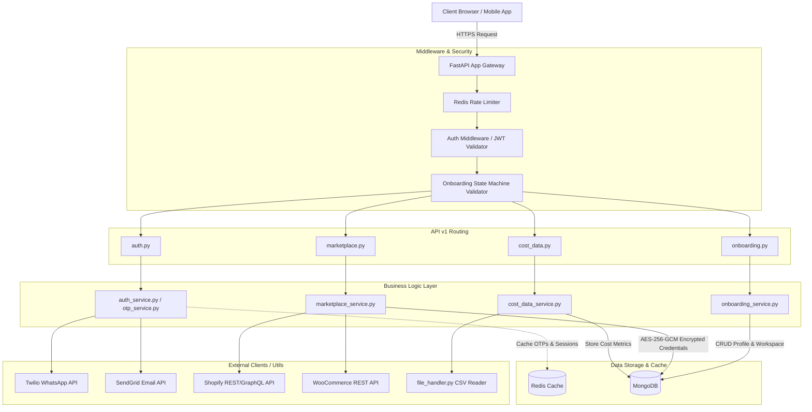

# **Realify AI Onboarding & Marketplace Intelligence Backend**

[](https://fastapi.tiangolo.com/)
[](https://www.mongodb.com/)
[](https://redis.io/)
[](https://www.python.org/)

A secure, highly scalable, and modular asynchronous backend for the **Realify AI Marketplace Intelligence Platform**. The system provides a passwordless/OTP-centric user onboarding pipeline, multi-tenant workspace isolation, secure marketplace credential storage, Shopify/WooCommerce store integrations, and merchant cost data ingestion.

---

## 🏗️ **System Architecture**

The backend strictly follows a decoupled, service-oriented architecture within a modular monolith. Business logic in the service layer is entirely separated from API routing and database operations.



---

## 📂 **Project Directory Structure**

The repository is structured logically to separate concerns into specific modules:

```text
├── app/
│   ├── api/
│   │   └── v1/
│   │       ├── routes/
│   │       │   ├── auth.py           # OTP requests, validation, and tokens
│   │       │   ├── cost_data.py      # Upload and ingest merchant cost data
│   │       │   ├── marketplace.py    # Shopify OAuth handshake & WooCommerce config
│   │       │   └── onboarding.py     # Profile generation & workspace creation
│   │       └── __init__.py
│   ├── config/
│   │   ├── config.py                 # Pydantic BaseSettings environment validation
│   │   └── database.py               # Async MongoDB client setup (Motor) & Redis connection
│   ├── core/
│   │   └── security.py               # JWT encoding/decoding & AES-256-GCM encryption utilities
│   ├── middleware/
│   │   └── auth_middleware.py        # Authentication & onboarding state gating dependencies
│   ├── models/
│   │   ├── onboarding.py             # Pydantic/Motor schemas for workspaces and integration state
│   │   └── user.py                   # User document models & onboarding state enumeration
│   ├── schemas/
│   │   ├── auth.py                   # Input/output schemas for authentication payloads
│   │   └── onboarding.py             # Validation schemas for profile, workspaces, & integration
│   ├── services/
│   │   ├── auth_service.py           # Authentication session handling
│   │   ├── cost_data_service.py      # Standardizes cost metrics & QuickBooks syncing
│   │   ├── email_service.py          # SendGrid integration wrapper
│   │   ├── marketplace_service.py    # OAuth handling & store validation logic
│   │   ├── onboarding_service.py     # Step-by-step onboarding pipeline execution
│   │   ├── otp_service.py            # OTP generation, caching, and matching
│   │   └── whatsapp_service.py       # Twilio integration wrapper
│   ├── utils/
│   │   ├── file_handler.py           # Secure file handler & CSV parser
│   │   └── validators.py             # Generic formatting & domain validators
│   └── main.py                       # Application entry point, middleware register & startup events
├── tests/
│   ├── conftest.py                   # Pytest async fixtures, mock databases, and environment configuration
│   ├── test_auth.py                  # Authentication endpoints test suite
│   ├── test_cost_data.py             # Cost data CSV ingestion test suite
│   ├── test_marketplace.py           # Shopify OAuth & WooCommerce endpoint test suite
│   └── test_onboarding.py            # Onboarding state machine test suite
├── .env.example                      # Reference template for required environment configurations
├── .gitignore                        # Standard Python gitignore filters
└── requirements.txt                  # Python dependency list
```

---

## ⚡ **Onboarding State Machine**

Access to endpoints is guarded dynamically using `auth_middleware.py` which evaluates the user's current `onboarding_state`.

```text
  [ AWAITING_PROFILE ] ────► Captures first_name, last_name, and role
           │
           ▼
 [ AWAITING_WORKSPACE ] ──► Registers tenant/company metadata
           │
           ▼
[ AWAITING_INTEGRATION ] ─► Initiates Shopify OAuth or WooCommerce connection
           │
           ▼
       [ ACTIVE ] ────────► Access granted to core dashboard metrics & cost ingestion
```

---

## 🚀 **Getting Started**

### **Prerequisites**
- **Python**: version 3.10 or higher.
- **MongoDB**: A running MongoDB instance (local or Atlas cluster).
- **Redis**: A running Redis instance (local or cloud).

### **1. Clone & Set Up Environment**
```bash
git clone <repository_url>
cd Onboarding_Backend
```

Create a virtual environment and activate it:
* **Linux/macOS:**
  ```bash
  python3 -m venv venv
  source venv/bin/activate
  ```
* **Windows (PowerShell):**
  ```powershell
  python -m venv venv
  .\venv\Scripts\Activate.ps1
  ```

Install dependencies:
```bash
pip install -r requirements.txt
```

### **2. Environment Variables Setup**
Copy the `.env.example` file and fill in your details:
```bash
cp .env.example .env
```
Ensure you generate a secure 32-byte secret key for credential encryption (`ENCRYPTION_KEY`) and a secure JWT signature secret (`JWT_SECRET`). You can generate keys using Python:
```bash
python -c "import secrets; print(secrets.token_hex(32))"
```

### **3. Running the Server**
Run the server locally in development mode with hot-reloading:
```bash
uvicorn app.main:app --reload --host 127.0.0.1 --port 8000
```
Once started:
- **Interactive Swagger Docs:** [http://127.0.0.1:8000/docs](http://127.0.0.1:8000/docs)
- **ReDoc Alternative Docs:** [http://127.0.0.1:8000/redoc](http://127.0.0.1:8000/redoc)

---

## 🔐 **Security Protocols**

To protect merchant intelligence and marketplace credentials, the backend enforces the following security standards:

* **Payload Validation:** Pydantic V2 schemas enforce strict input sanitation, preventing NoSQL injection.
* **Credential Encryption:** Third-party access tokens and API credentials (e.g., Shopify tokens, WooCommerce secrets) are encrypted at rest using **AES-256-GCM** via the `cryptography` module before storage.
* **Rate Limiting:** Enforced at the gateway layer using Redis on all `/v1/auth/*` routes to safeguard against brute-force and credential-stuffing attacks.
* **State Gating:** Every non-auth request is dynamically scanned to verify that the user has completed onboarding steps up to their required access levels.

---

## 🔌 **API Route Contracts**

### **1. Authentication Module** `/v1/auth/`
*Google/Apple SSO are excluded. Authentication relies purely on secure passwordless OTP.*

| Method | Endpoint | Description | Handled By |
| :--- | :--- | :--- | :--- |
| `POST` | `/v1/auth/request-otp` | Request a verification code sent to Email or WhatsApp. | `otp_service.py` |
| `POST` | `/v1/auth/verify-otp` | Validate code, create user if new, and return access tokens. | `auth_service.py` |
| `POST` | `/v1/auth/refresh` | Rotate access tokens using the HTTP-only secure refresh token. | `auth_service.py` |

### **2. Onboarding Module** `/v1/onboarding/`
*Strictly enforces sequential profile step updates.*

| Method | Endpoint | Description | Handled By |
| :--- | :--- | :--- | :--- |
| `POST` | `/v1/onboarding/profile` | Capture basic profile metadata (`first_name`, `last_name`, `role`). | `onboarding_service.py` |
| `POST` | `/v1/onboarding/workspace` | Setup the tenant/company context owned by the authenticated user. | `onboarding_service.py` |
| `GET` | `/v1/onboarding/status` | Read the current onboarding state & required next actions. | `onboarding_service.py` |

### **3. Marketplace Integration Module** `/v1/marketplace/`
*Handshakes and secures credentials for third-party e-commerce channels.*

| Method | Endpoint | Description | Handled By |
| :--- | :--- | :--- | :--- |
| `GET` | `/v1/marketplace/shopify/install` | Initiates the Shopify OAuth handshake sequence. | `marketplace_service.py` |
| `GET` | `/v1/marketplace/shopify/callback` | Exchanges authorization code for Shopify access token. | `marketplace_service.py` |
| `POST` | `/v1/marketplace/woocommerce` | Verifies WooCommerce credentials and stores them. | `marketplace_service.py` |

### **4. Cost Data Ingestion Module** `/v1/cost-data/`
*Uploads operational costs.*

| Method | Endpoint | Description | Handled By |
| :--- | :--- | :--- | :--- |
| `POST` | `/v1/cost-data/upload` | Upload and parse merchant cost CSV worksheets. | `cost_data_service.py` |
| `POST` | `/v1/cost-data/manual` | Manually insert standard cost objects. | `cost_data_service.py` |

---

## 🧪 **Testing Suite**

The project maintains a test suite leveraging `pytest` with `pytest-asyncio` for routing and service logic assertion.

Run tests:
```bash
pytest
```

Run tests with test coverage reporting:
```bash
pytest --cov=app --cov-report=term-missing
```

---

## 🗺️ **Phased Implementation Roadmap**

- [ ] **Phase 1 (Foundation):** Setup FastAPI base project, MongoDB (Motor) connection client, Redis connection client, configuration models, and base route registrations.
- [ ] **Phase 2 (Auth & Security):** Implement OTP code generation/caching, Twilio/SendGrid templates, JWT token generation, and the `auth_middleware.py` gating setup.
- [ ] **Phase 3 (Onboarding):** Implement user profiling and workspace organization building logic, locking down access using state enumeration.
- [ ] **Phase 4 (Marketplaces):** Write Shopify OAuth installation/callback scripts, WooCommerce key verification hooks, and database credential encryption wrappers.
- [ ] **Phase 5 (Cost Ingestion & QA):** Build the multipart CSV reader, integrate QuickBooks APIs, verify performance against test suites, and reach >85% test coverage.